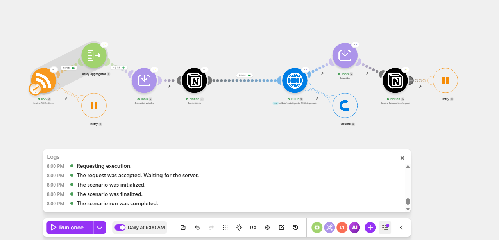
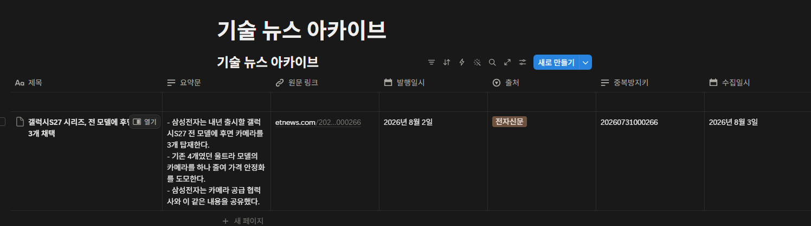
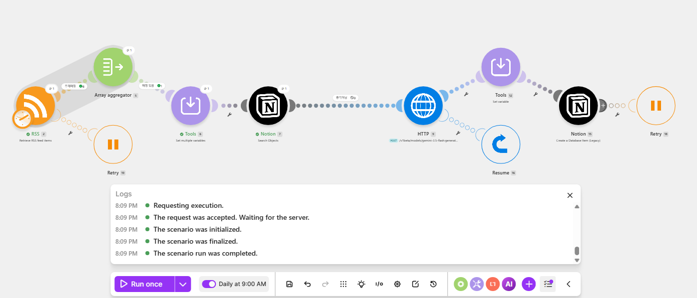
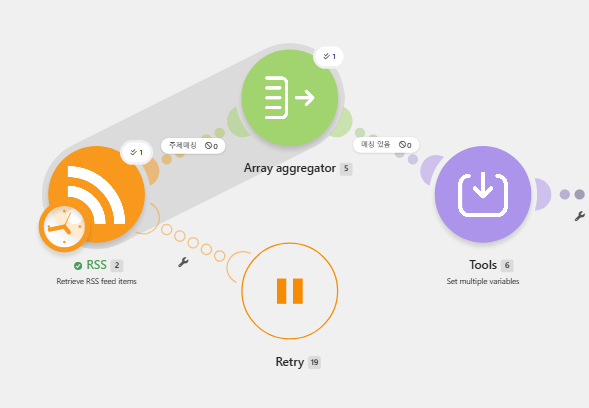
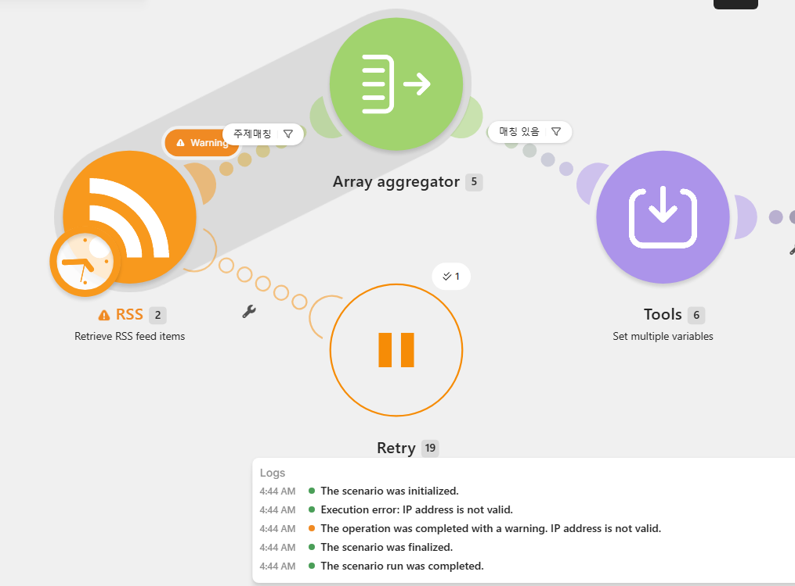
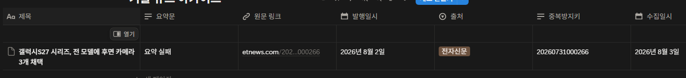
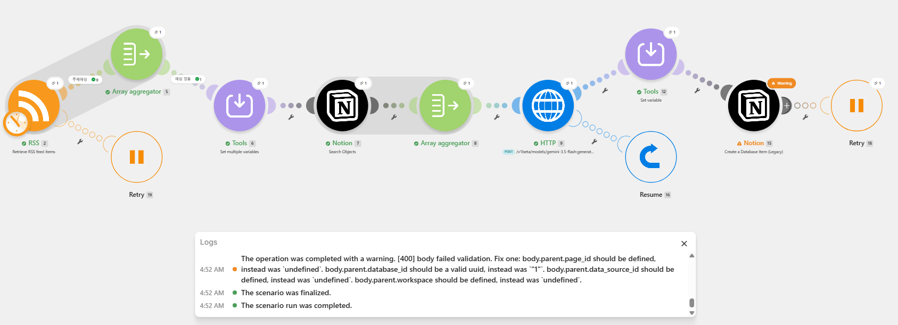
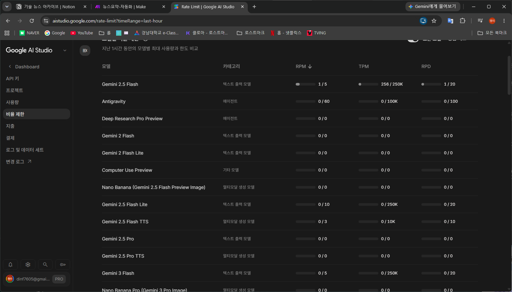

# 뉴스 요약 자동화 시스템

매일 09:00(KST) 기술 뉴스 RSS를 자동 수집해, 지정 주제에 해당하는 기사 1건을
생성형 AI로 3줄 요약한 뒤 Notion 데이터베이스에 저장하는 **무인 자동화 시스템**.

## 사용 툴

| 구분 | 도구 | 비고 |
|---|---|---|
| 자동화 | **Make** | 노코드 시각적 워크플로우 빌더 |
| 생성형 AI | **Google Gemini API** | 무료 티어, 모델 `gemini-3.5-flash` |
| 저장소 | **Notion** | DB명 `기술 뉴스 아카이브` |

> 생성형 AI는 OpenAI API 대신 **Google Gemini API**를 사용했다.
> 신용카드 등록 없이 무료 티어를 쓸 수 있어 "월 운영 비용 0원" 요건을 확실히 지킬 수 있고,
> 본 시스템의 사용량(1일 1회)이 무료 한도의 5%에 불과하기 때문이다.

---

## 1. 요구사항 대응표

| 요구사항 | 구현 | 근거 |
|---|---|---|
| **1. 데이터 수집** | | |
| RSS 피드로 기술 뉴스 자동 수집 | 전자신문 RSS, 회당 20건 | [3장](#3-동작-흐름과-단계별-역할) |
| 매일 설정 시간에 트리거 자동 작동 | 매일 09:00 (Asia/Seoul) | [7장 S1](#s1--자동-실행-기록) |
| 사전 정의 주제 1건 선택 + 제목·링크·본문 추출 | 키워드 필터 → 최신 1건 | [5장](#5-주제-필터링-기준과-선택-이유) |
| **2. AI 가공** | | |
| 생성형 AI로 3줄 이내 요약 | Gemini, 기사당 1회 | [4장](#4-실행-결과) |
| **3. 자동 저장** | | |
| 협업 도구 DB에 자동 저장 | Notion `기술 뉴스 아카이브` | [4장](#4-실행-결과) |
| 제목·요약문·원문 링크·발행일시가 올바른 속성에 | Title / Text / URL / Date | [4장](#4-실행-결과) |
| **4. 안정성** | | |
| 사람 개입 없이 자동 완료 | 스케줄 트리거 무인 실행 | [7장 S1](#s1--자동-실행-기록) |
| 뉴스 미수집·오류 시 적절히 처리 | E-01~E-10 정책 + 주입 테스트 4종 통과 | [6장](#6-에러-처리-정책과-선택-이유) |
| **5. 비용/중복 방지** | | |
| 중복 저장 방지 키 1개 이상 | RSS `guid` (없으면 링크 해시) | [7장 S3](#s3--s4--중복-시-ai를-호출하지-않는다) |
| 요약 호출 기사당 1회 (재시도 제외) | 중복 체크를 AI 호출보다 앞에 배치 | [7장 S4](#s3--s4--중복-시-ai를-호출하지-않는다) |
| 재시도 최대 2회 상한 | 모든 에러 핸들러 `2회` | [6장](#make-에러-핸들러-배치) |

---

## 2. 제약 사항 준수

| 제약 | 준수 방법 |
|---|---|
| **RSS 없는 사이트 크롤링 금지** | RSS 피드 URL만 입력받는다. HTML 페이지를 파싱하는 경로가 시스템에 **존재하지 않는다**. 참조 구현 `prototype/rss.py`도 마찬가지 |
| **무한 루프 트리거 금지** | 트리거는 `Every day 09:00` **1일 1회 고정**. 시나리오가 자기 자신을 재트리거하는 구조가 없다. 모든 재시도는 상한 2회 |
| **API 키/토큰을 환경 변수 또는 비공개 저장소에** | Gemini 키는 Make **Keychain**, Notion 토큰은 Make **Connection**에 저장. 모듈 필드에 직접 입력하지 않는다. 참조 구현은 `.env`(gitignore 처리)에서 환경 변수로 읽는다 — 저장소에 키가 없다 |
| **문서·스크린샷 마스킹** | 커밋된 스크린샷 10장을 전수 육안 검사. 키·토큰 노출 0건 |
| **원문 저작권** | 기사 **전문을 저장하지 않는다.** 요약문과 원문 링크만 남긴다 |

```
# .gitignore
.env
```

---

## 3. 동작 흐름과 단계별 역할

```
[1] 스케줄 트리거 (매일 09:00 Asia/Seoul)
       ↓
[2] RSS 수집 — 전자신문 최신 20건
       ↓
[3] 주제 필터링 ─── 매칭 0건 → [정상 스킵] 종료
       ↓
[4] 중복 체크 ───── 이미 저장됨 → [정상 스킵] 종료 (AI 호출 안 함)
       ↓
[5] Gemini 3줄 요약 (기사당 정확히 1회)
       ↓
[6] Notion 저장 (제목 / 요약문 / 원문 링크 / 발행일시)
```

**중복 체크를 AI 호출보다 앞에 둔 것이 이 설계의 핵심이다.** 이미 저장된 기사를
다시 요약하는 낭비를 원천 차단해 무료 한도와 비용을 방어한다.

### 워크플로우 구조


### 각 모듈의 역할과 연결

| # | 모듈 | 입력 | 하는 일 | 출력 |
|---|---|---|---|---|
| `2` | RSS — Retrieve feed items | 피드 URL | 최신 20건 조회 | 기사 20번들 |
| 🔧 | Filter `주제 매칭` | 기사 20번들 | 키워드 정규식으로 걸러냄 | 통과분만 (실측 9건) |
| `5` | Array aggregator | 통과분 | 배열 1건으로 집계 | **배열 1번들 (0건이어도)** |
| 🔧 | Filter `매칭 있음` | 배열 | `length > 0` 판정 | 통과 or **E-03 종료** |
| `6` | Tools — Set multiple variables | 배열 | 최신 1건을 골라 제목·링크·본문·발행일시·중복방지키 추출 | 변수 6개 |
| `7` | Notion — Search Objects | 중복방지키 | DB에서 같은 키 조회 | 조회 결과 |
| `8` | Array aggregator | 조회 결과 | 배열 1건으로 집계 | **배열 1번들 (0건이어도)** |
| 🔧 | Filter `중복 아님` | 배열 | `length = 0` 판정 | 통과 or **E-04 종료** |
| `9` | HTTP — Gemini 호출 | 제목·본문 | 3줄 요약 생성 (**기사당 1회**) | JSON 응답 |
| `12` | Tools — Set variable | 응답 | 앞 3줄만 잘라냄 (E-07) | 요약문 |
| `15` | Notion — Create Database Item | 변수 + 요약문 | DB에 행 생성 | 저장 완료 |

### 왜 집계 모듈이 두 개나 들어가는가

Make는 **필터나 검색 결과가 0건이면 뒤따르는 모듈이 아예 실행되지 않고 흐름이 끝난다.**
그러면 "오늘은 매칭 기사가 없었다"를 기록하는 것조차 불가능하다.

Array aggregator는 입력이 0건이어도 **빈 배열 1건을 반드시 내보낸다.**
이 단계를 끼워야 뒤에서 `length(array)`로 0건 여부를 판정하고 정상 스킵을 로그로 남길 수 있다.

기획 초안의 흐름도에는 이 단계가 없었고, 실제로 만들면서 발견해 추가했다.
E-03 주입 테스트가 이 구조의 필요성을 실측으로 증명한다([7장](#e-03--키워드-매칭-0건-정상-스킵)).

### 트리거 설정



| 항목 | 값 |
|---|---|
| 주기 | `Every day` |
| 시각 | `09:00` |
| 타임존 | `Asia/Seoul` (Make 프로필 설정) |

> `Every 15 minutes` 같은 반복 트리거는 쓰지 않는다. 1일 1회 고정이다.

---

## 4. 실행 결과

### Notion DB 스키마


| 속성 | 타입 | 필수 | 매핑 소스 |
|---|---|---|---|
| 제목 | **Title** | ✅ | RSS `title` |
| 요약문 | **Text** | ✅ | Gemini 응답 (불릿 3줄) |
| 원문 링크 | **URL** | ✅ | RSS `link` |
| 발행일시 | **Date** | ✅ | RSS `pubDate` |
| 출처 | Select | | 피드명 상수 |
| 중복방지키 | Text | | RSS `guid` |
| 수집일시 | Date | | 실행 시각 |

### 저장된 결과



4개 필수 속성이 각각 올바른 타입으로 저장된다.
요약문은 `- `로 시작하는 **3줄**이고, 원문 링크는 클릭 가능한 URL 타입이다.

---

## 5. 주제 필터링 기준과 선택 이유

```
1순위 (제목 매칭)     : AI, 인공지능, LLM, 생성형, ChatGPT, Gemini, Claude
2순위 (본문까지 확대)  : 머신러닝, 딥러닝, 반도체, GPU, 데이터센터
제외 (후보에서 배제)   : 광고, 협찬, 이벤트, 채용, 프로모션
```

| 정책 | 선택 이유 |
|---|---|
| 1순위는 제목만 매칭 | 제목에 키워드가 있으면 그 기사의 주제일 확률이 높다. 본문까지 보면 한 번 스쳐 지나간 언급까지 잡혀 엉뚱한 기사가 선택된다 |
| 2순위를 fallback으로 운영 | 1순위만 쓰면 매칭 0건인 날이 잦아져 "매일 아카이브된다"는 목적 자체가 무너진다 |
| 제외 키워드 운영 | 홍보성 기사는 요약할 내용이 없어 품질이 떨어지고, 그 한 번의 API 호출이 그날의 유일한 호출이 된다 |
| 복수 매칭 시 최신 1건 | "오늘의 뉴스" 성격에 맞고, 기준이 결정론적이라 같은 입력이면 항상 같은 결과가 나온다 |

### 구현 — 정규식 2그룹

```
그룹 1 (1순위, 제목만)              그룹 2 (2순위, 제목+본문)
├ 제목   Does not match  제외        ├ 제목   Does not match  제외
├ 본문   Does not match  제외        ├ 본문   Does not match  제외
└ 제목   Matches         1순위       └ 제목+본문  Matches      2순위
```

| 패턴 | 값 |
|---|---|
| 제외 | `(광고\|협찬\|이벤트\|채용\|프로모션)` |
| 1순위 | `(\bAI\b\|인공지능\|\bLLM\b\|생성형\|ChatGPT\|Gemini\|Claude)` |
| 2순위 | `(머신러닝\|딥러닝\|반도체\|\bGPU\b\|데이터센터)` |

> **`\b`(단어 경계)를 영문에만 붙인 이유**: `AI`는 `said`, `again`, `mail` 안에도 들어 있어
> 경계가 없으면 무관한 기사가 걸린다. 반대로 한글은 조사가 붙으므로(`인공지능이`) 경계를
> 요구하면 오히려 매칭에 실패한다.
>
> **제외 조건을 두 그룹에 모두 반복한 이유**: Make의 `Add OR rule`은 조건을 더하는 게 아니라
> **새 그룹을 만든다.** 제외 조건만 들어간 그룹이 생기면 대부분의 기사가 그 그룹 하나로
> 통과해버린다. 실제로 이 실수로 **20건이 전부 통과**해 주제와 무관한 기사가 선택됐다.
> 수정 후 20건 중 **9건** 통과로 정상화됐다.

---

## 6. 에러 처리 정책과 선택 이유

| 코드 | 상황 | 처리 | 재시도 | 이유 |
|---|---|---|---|---|
| E-01 | RSS 응답 없음/타임아웃 | 재시도 후 종료 + 로그 | 2회 | 대부분 일시적 네트워크 문제. 무한 재시도는 한도·비용 위험 |
| E-02 | RSS 파싱 실패 | 즉시 종료 | 0회 | 재시도해도 결과가 같다. 피드 구조 변경은 사람이 봐야 한다 |
| E-03 | 키워드 매칭 0건 | **정상 스킵** | — | 오류가 아니다. 관련 뉴스가 없는 날은 정상이며, 알리면 알림 피로도만 쌓인다 |
| E-04 | 중복 기사 | **정상 스킵** | — | 오류가 아니다. AI 호출 전에 끊어 비용을 막는다 |
| E-05 | Gemini 429 (한도 초과) | 재시도 후 요약 없이 저장 | 2회 | 원문 링크라도 남아야 나중에 수동 확인이 된다 |
| E-06 | Gemini 기타 오류 | `요약 실패` 기록 후 나머지 저장 | 2회 | 데이터 유실 방지가 요약 품질보다 우선이다 |
| E-07 | 응답 3줄 초과 | 앞 3줄만 잘라 저장 | 0회 | 재호출은 "기사당 1회" 원칙 위반. 후처리로 해결한다 |
| E-08 | 날짜 변환 실패 | 발행일시 비우고 저장 | 0회 | 부분 저장이 전체 실패보다 낫다 |
| E-09 | Notion 저장 실패 | 재시도 후 종료 + 알림 | 2회 | 최종 산출물이 유실되므로 사람이 알아야 한다 |
| E-10 | 인증/권한 오류 | 즉시 종료 + 알림 | 0회 | 재시도로 풀리지 않는 설정 문제다 |

**공통 원칙**

1. **정상 스킵과 오류를 구분한다.** E-03·E-04는 알림을 보내지 않는다. 실제 장애만 드러나게 해야
   알림 피로도가 쌓이지 않고 진짜 문제를 놓치지 않는다.
2. **모든 재시도는 최대 2회.** 무한 루프와 비용 폭증을 막는다.
3. **시나리오가 자기 자신을 재트리거하지 않는다.**
4. **실패해도 저장은 진행한다.** 요약 실패(E-05·E-06)와 날짜 변환 실패(E-08)는 해당 필드만
   비우거나 대체하고 나머지를 저장한다.

### Make 에러 핸들러 배치

| 모듈 | 핸들러 | 설정 | 이유 |
|---|---|---|---|
| RSS `2` | `Retry` | 2회, 5분 간격 | E-01 |
| HTTP `9` (Gemini) | **`Resume`** | 출력 비움 | E-06. `Retry`를 걸면 저장까지 막혀 원문 링크를 잃는다. `Resume`이라야 출력이 비고 `ifempty`가 `요약 실패`를 채워 저장이 진행된다 |
| Notion `15` | `Retry` | 2회, 5분 간격 | E-09 |

`skip`은 쓰지 않는다 — 실패한 번들을 조용히 버려서 "실제 장애는 드러나야 한다"는 원칙이 무너진다.

### 알림 채널

Make 기본 이메일 알림을 쓴다. 별도 알림 시나리오를 만들지 않아 무료 플랜의
활성 시나리오 2개 한도 안에서 운영된다.

---

## 7. 검증 결과

| ID | 성공 기준 | 상태 | 근거 |
|---|---|---|---|
| S1 | 7일 연속 무인 실행 | ⏳ 진행 중 | 2026-08-03 스케줄 ON |
| S2 | 4개 필수 속성 매핑 100% | ✅ | [저장 결과](#저장된-결과) |
| S3 | 중복 저장 0건 | ✅ | 아래 |
| S4 | 요약 호출 기사당 1회 | ✅ | 아래 |
| S5 | 월 API 비용 0원 | ✅ | 아래 |
| S6 | 팀원 전원 담당 모듈 설명 | ⏳ | 발표 시 |

### S3 · S4 — 중복 시 AI를 호출하지 않는다



같은 기사로 두 번째 실행. `중복 아님` 필터가 **0**을 반환하고, 그 뒤의
**HTTP `9` · Tools `12` · Notion `15`에 실행 배지가 없다.**
Gemini를 호출하지 않고 종료했으며 Notion 행은 1건으로 유지됐다.

이것이 "요약 호출 기사당 1회"와 "중복 저장 0건"의 동시 근거다.

### 오류 주입 테스트

운영 시나리오를 복제한 `뉴스요약-테스트용`에서 수행했다.
운영본에서 하면 7일 연속 기록이 그날 끊기기 때문이다.

#### E-03 — 키워드 매칭 0건 (정상 스킵)



주제 키워드를 존재하지 않는 단어로 교체. `주제매칭`이 **0**을 반환했지만
집계 모듈이 빈 배열 1건을 내보내 흐름이 이어졌고, `매칭 있음`에서 정상 종료했다.
**실행 상태가 Error가 아니며 알림도 발생하지 않는다.**

#### E-01 — RSS 응답 없음



피드 URL을 유효하지 않은 주소로 교체. `Retry` 핸들러가 받아 **무한 반복 없이 종료**했다.

#### E-06 — Gemini API 오류



모델명을 없는 이름으로 교체해 404를 유발. 요약문에 **`요약 실패`**가 들어갔지만
**제목·원문 링크·발행일시·출처·중복방지키는 정상 저장**됐다.
"데이터 유실 방지가 요약 품질보다 우선"이라는 정책이 그대로 동작한다.

#### E-09 — Notion 저장 실패



Database를 잘못된 값으로 교체. `[400] body failed validation` 응답을
`Retry` 핸들러가 받아 재시도 후 종료했다.

### S5 — 무료 한도 확인



결제를 활성화하지 않은 상태의 실제 한도는 **RPM 5 / RPD 20**이다.
본 시스템은 **1일 1회 호출**이므로 한도의 5%만 사용한다.

Make도 무료 플랜(월 1,000 ops) 안에서 운영된다 — 실행당 10~14 ops × 30일 ≈ 300~420 ops.

### S1 — 자동 실행 기록

<!-- 7일 연속 실행 기록이 쌓이면 아래 이미지를 추가한다 -->
<!--  -->

> **행이 늘지 않은 날도 성공이다.** 같은 기사면 E-04, 관련 기사가 없으면 E-03으로
> 정상 스킵되며, 성공 기준 자체가 "7건 **또는 정상 스킵 로그**"다.

---

## 8. 주요 설계 판단

기획 초안과 **다르게 결정한 것들**이다. 각 항목의 상세 근거는
[docs/PRD_뉴스요약_자동화.md](docs/PRD_뉴스요약_자동화.md)(v1.2)에 기록돼 있다.

| 항목 | 초안 | 실제 | 이유 |
|---|---|---|---|
| RSS 피드 | ZDNet Korea | **전자신문** | ZDNet 주소가 HTTP 404. 전자신문은 guid 20/20, description 평균 248자로 후보 중 유일하게 전 항목 통과 |
| 백업 피드 | Google News | 유지 (미사용) | guid는 있으나 description이 41자뿐이라 요약 품질이 나오지 않는다 |
| Gemini 모델 | (미정) | **`gemini-3.5-flash`** | `gemini-2.5-flash`는 신규 계정에 `no longer available` 404 |
| 키워드 fallback | 1순위 실패 시 2순위 (2단계) | 1·2순위를 OR로 합침 | Make Filter는 번들을 하나씩 통과시켜 "전부 훑은 뒤 0건이었는지" 판정이 불가능 |
| 무료 한도 | 일 100~1,000회 | **RPD 20** | 실측. 운영(1일 1회)엔 여유가 크지만 **개발 중 디버깅 여유가 하루 6~7회**뿐 |
| 크레딧 추정 | 실행당 6~8 | **10~14 ops** | 집계·변수 모듈이 추가되며 증가. 월 300~420으로 1,000 한도 내 |
| 발행일시 | 시각까지 저장 | **날짜만** | 1일 1건 아카이브라 같은 날 2건이 겹치지 않아 시각이 식별에 불필요 |
| Sequential processing | 켜기 | **끄기** | 켜면 미완료 실행 1건이 **이후 모든 예약 실행을 막아** 7일 연속이 통째로 무너진다 |

### Gemini 요청 본문의 이스케이프 처리

RSS `description`에는 HTML 태그가 섞여 오고 그 안에 큰따옴표가 들어 있다.
그대로 JSON에 넣으면 **본문의 따옴표 하나로 요청이 깨져 400이 난다.**

```
본문 = replace(replace(<description>; "/<[^>]*>/g"; " "); "/[\x22\x5C\n\r\t]/g"; " ")
```

`\x22`(`"`)와 `\x5C`(`\`)를 코드로 지정해 Make 수식 파서가 문자열 끝으로 오인하는 것을 막았다.
부수 효과로 HTML 태그도 제거되어 요약 품질이 함께 올라간다.

---

## 9. 학습 목표 — 설명할 수 있어야 하는 것

### RSS 수집 → AI 가공 → 저장 워크플로우

RSS는 사이트가 **스스로 공개하는 구조화된 XML**이다. 크롤링과 달리 저작권 문제가 없고
`title` · `link` · `pubDate` · `description` · `guid` 필드가 일정한 형태로 온다.

자동화 툴은 이 XML을 **번들(bundle)** 단위로 쪼개 다음 모듈에 흘려보낸다.
각 모듈은 앞 모듈의 출력을 매핑(`{{6.제목}}`)으로 받아 자기 일을 하고 다음으로 넘긴다.
필터는 모듈이 아니라 **연결선 위에 얹는 검문소**로, 조건에 맞는 번들만 통과시킨다.

이 파이프라인에서 가장 중요한 설계 결정은 **모듈의 순서**다.
중복 체크를 AI 호출보다 앞에 두면 이미 처리한 기사에 API를 쓰지 않는다.
순서 하나로 비용 구조가 바뀐다.

### 생성형 AI로 텍스트 요약을 자동화하는 방법

HTTP 요청으로 모델에 **프롬프트 + 기사 본문**을 보내고 응답 텍스트를 받는다.
자동화에서 중요한 것은 프롬프트 자체보다 **출력을 신뢰하지 않는 것**이다.

- 모델이 3줄을 넘기거나 머리말을 붙일 수 있다 → **재호출하지 않고 후처리로 자른다.**
  재호출은 "기사당 1회" 원칙을 깨고 한도를 소모한다.
- 모델이 응답하지 않을 수 있다 → 요약 자리에 `요약 실패`를 넣고 **나머지 필드는 저장**한다.
- 기사 본문의 따옴표가 요청 JSON을 깨뜨릴 수 있다 → 보내기 전에 이스케이프한다.

즉 "AI를 부르는 법"보다 **"AI가 예상대로 답하지 않을 때 무엇을 지킬 것인가"**가 설계의 본체다.

### 스케줄 트리거와 에러 처리를 포함한 안정적 설계 원리

| 원리 | 이 시스템에서 |
|---|---|
| **트리거는 1일 1회 고정** | 반복 트리거는 하루 만에 한도를 태운다. 자기 재트리거 구조를 만들지 않는다 |
| **재시도에는 반드시 상한** | 전 구간 2회. 상한이 없으면 장애가 비용 폭증으로 번진다 |
| **정상 스킵과 오류를 구분** | 매칭 0건은 실패가 아니다. 섞으면 알림이 무의미해지고 진짜 장애를 놓친다 |
| **부분 실패 시 무엇을 지킬지 미리 정한다** | 데이터 유실 방지 > 필드 완전성. 요약이 없어도 원문 링크는 남긴다 |
| **비싼 호출 앞에 저렴한 검사를 배치** | 중복 체크(DB 조회) → AI 호출 순서 |
| **"0건"도 감지 가능한 형태로 만든다** | 집계 단계를 끼워 빈 배열 1건을 만든다. 없으면 정상 스킵을 기록조차 못 한다 |
| **운영본과 테스트본을 분리** | 오류 주입 테스트는 복제본에서. 운영본에서 하면 연속 실행 기록이 끊긴다 |

---

## 10. 팀 역할 / 개인별 작업 요약

<!-- 이름과 작업 내용을 채워 넣을 것 -->

| 담당 | 이름 | 역할 | 실제 작업 내용 |
|---|---|---|---|
| A | `TODO` | 팀장 / 워크플로우 설계 | Make 계정·타임존 설정, 시나리오 통합, 스케줄 트리거, 집계 모듈, 크레딧 모니터링 |
| B | `TODO` | 데이터 수집 | RSS 피드 조사·선정(`check_feed.py` 실측), RSS 모듈, 주제 필터 정규식 |
| C | `TODO` | AI 요약 | Gemini 키 발급, 모델 선정, 프롬프트 설계, HTTP 모듈, 3줄 후처리 |
| D | `TODO` | 저장 / 중복 방지 | Notion DB 스키마, 통합 연결, 중복방지키 설계, 조회·저장 모듈 |
| E | `TODO` | 품질 / 문서 | 오류 주입 테스트 4종, 에러 정책 문서화, README, 스크린샷 마스킹 검수 |

---

## 11. 요약 프롬프트

```
너는 기술 뉴스를 요약하는 편집자야.
아래 기사를 정확히 3줄 이내로 요약해줘.

규칙:
- 각 줄은 "- "로 시작하는 불릿 형태
- 각 줄 60자 이내
- 사실만 전달하고 추측이나 의견을 넣지 말 것
- 기사에 없는 내용을 만들어내지 말 것
- 요약 외의 머리말, 맺음말, 설명은 출력하지 말 것

제목: {{제목}}
본문: {{본문}}
```

| 문장 | 왜 넣었나 |
|---|---|
| "너는 기술 뉴스를 요약하는 편집자야" | 역할 부여. 문체가 뉴스 요약체로 안정된다 |
| "정확히 3줄 이내" | 출력 형식 제약 |
| `- ` 불릿 지정 | Notion Text에 그대로 넣어도 읽히는 형태 |
| "사실만 / 만들어내지 말 것" | 환각 억제. 요약문이 원문과 어긋나면 검수에서 걸린다 |
| "머리말, 맺음말 금지" | "다음은 요약입니다:" 같은 군더더기가 저장되는 것을 막는다 |

초안 → 수정 → 최종 이력은 [docs/프롬프트-이력.md](docs/프롬프트-이력.md).

---

## 12. 저장소 구성

```
docs/
  PRD_뉴스요약_자동화.md    기획 원본 (v1.2)
  make-시나리오-명세.md      Make 모듈별 설정값·수식 전문
  notion-db-스키마.md        DB 속성 정의와 통합 연결 절차
  프롬프트-이력.md           초안→수정→최종 기록
  에러-테스트-케이스.md      E-01~E-10 주입 테스트 절차 및 결과
  작업-진행상황.md           현재 상태 / 이미 밟은 지뢰 10건
  조원별-실행가이드.md       팀 작업용 (초심자 기준)
  혼자-진행-가이드.md        1인 진행 시 순서·일정
  images/                    제출용 스크린샷
prototype/                   Make로 옮기기 전 로직을 확정한 참조 구현
```

### 참조 구현

Make 시나리오를 만들기 전에 로직을 코드로 먼저 확정했다.
**외부 호출 0회 / 크레딧 소모 0**이라 개발 중 API 한도를 쓰지 않고 검증할 수 있다.

```bash
cd prototype && python pipeline.py --dry-run
```

```bash
cd prototype/tests && python -m unittest discover -s . -p "test_*.py"
```

표준 라이브러리만 사용하며 `pip install`이 필요 없다. 테스트 **54건**.

---

## 13. 제출물 체크리스트

**1. 자동화 워크플로우**
- [x] 매일 설정된 시간에 자동 실행 (09:00 Asia/Seoul)
- [x] 워크플로우 구조 스크린샷 ([3장](#워크플로우-구조))
- [x] 단계별 역할·연결 구조 설명 ([3장](#각-모듈의-역할과-연결))

**2. Notion 데이터베이스 페이지**
- [x] AI 요약 텍스트가 포함된 뉴스 콘텐츠
- [x] 제목·요약문·원문 링크·발행일시가 올바른 속성에 저장

**3. README**
- [ ] 팀 역할 / 개인별 작업 요약 ← **이름 기입 필요**
- [x] 주제 필터링 기준과 선택 이유
- [x] 에러 처리 정책과 선택 이유
- [x] 사용 툴명 명시

**보안**
- [x] API 키가 Make Connection/Keychain에만 저장
- [x] 스크린샷 마스킹 검수 완료 (10장 전수)
